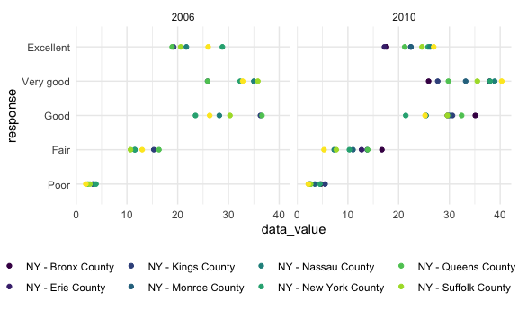
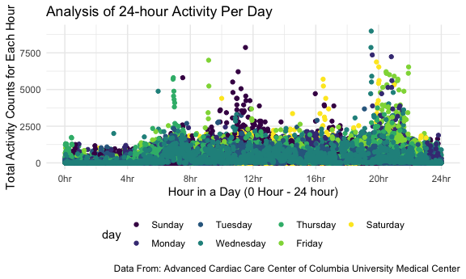

p8105\_hw3\_tk2886
================
Tanvir Khan
2021-10-21

# QUESTION 1

### Loading the instacart data and cleaning the instacart data

``` r
data("instacart")

instacart_df <- 
  instacart %>% 
  janitor::clean_names()
```

This information was gathered from the p8105 website. It is indicated
that Instacart is an online grocery service that allows people to shop
online from local stores. In New York City, some of the partner stores
include Whole Foods, Fairway, and The Food Emporium. “The Instacart
Online Grocery Shopping Dataset 2017” is an anonymized dataset with over
3 million online grocery orders from more than 200,000 Instacart users.
We will be using this dataset to analyze specific things and outputting
the results in a table or visual plots.

### Analysis of instacart data

``` r
dimension_instacart = 
  instacart_df %>% 
  dim()

instacart_row = 
  instacart_df %>% 
  nrow()

instacart_col = 
  instacart_df %>% 
  ncol()

key_variables = 
  instacart_df %>% 
  names()
```

The dimension of the *instacart dataframe* is **1384617, 15**. The
dimensions represents the number of rows and the columns. The number of
*rows* in the instacart dataframe are **1384617**. The number of
*columns* in the instacart dataframe are **15**.

### Analyzing the Aisle column in the dataframe

``` r
instacart_df %>%
  group_by(aisle) %>%
  summarise(quantity_ordered = n()) %>%
  arrange(desc(quantity_ordered)) %>%
  knitr::kable()
```

| aisle                         | quantity\_ordered |
|:------------------------------|------------------:|
| fresh vegetables              |            150609 |
| fresh fruits                  |            150473 |
| packaged vegetables fruits    |             78493 |
| yogurt                        |             55240 |
| packaged cheese               |             41699 |
| water seltzer sparkling water |             36617 |
| milk                          |             32644 |
| chips pretzels                |             31269 |
| soy lactosefree               |             26240 |
| bread                         |             23635 |
| refrigerated                  |             23228 |
| ice cream ice                 |             22676 |
| frozen produce                |             22453 |
| eggs                          |             19875 |
| crackers                      |             19592 |
| frozen meals                  |             18221 |
| energy granola bars           |             17449 |
| lunch meat                    |             16957 |
| soft drinks                   |             16279 |
| cereal                        |             16201 |
| fresh herbs                   |             16052 |
| fresh dips tapenades          |             15142 |
| soup broth bouillon           |             15109 |
| juice nectars                 |             14350 |
| packaged produce              |             13460 |
| baby food formula             |             13198 |
| baking ingredients            |             13088 |
| other creams cheeses          |             12820 |
| hot dogs bacon sausage        |             12813 |
| paper goods                   |             12694 |
| canned jarred vegetables      |             12679 |
| nuts seeds dried fruit        |             12532 |
| cream                         |             12356 |
| spreads                       |             12102 |
| canned meals beans            |             11774 |
| candy chocolate               |             11453 |
| dry pasta                     |             11298 |
| oils vinegars                 |             10620 |
| butter                        |             10575 |
| cookies cakes                 |              9980 |
| instant foods                 |              9917 |
| breakfast bakery              |              9851 |
| condiments                    |              9743 |
| pasta sauce                   |              9736 |
| frozen breakfast              |              9729 |
| tea                           |              9376 |
| spices seasonings             |              9279 |
| frozen appetizers sides       |              8870 |
| coffee                        |              8392 |
| tortillas flat bread          |              8353 |
| missing                       |              8251 |
| frozen pizza                  |              7661 |
| asian foods                   |              7007 |
| popcorn jerky                 |              6917 |
| fruit vegetable snacks        |              6741 |
| hot cereal pancake mixes      |              6352 |
| grains rice dried goods       |              6134 |
| cleaning products             |              5894 |
| packaged poultry              |              5608 |
| poultry counter               |              5208 |
| preserved dips spreads        |              5188 |
| tofu meat alternatives        |              5123 |
| buns rolls                    |              5054 |
| pickled goods olives          |              4882 |
| doughs gelatins bake mixes    |              4758 |
| energy sports drinks          |              4742 |
| frozen vegan vegetarian       |              4727 |
| salad dressing toppings       |              4719 |
| laundry                       |              4636 |
| prepared meals                |              4133 |
| canned fruit applesauce       |              3996 |
| specialty cheeses             |              3873 |
| dish detergents               |              3870 |
| granola                       |              3803 |
| latino foods                  |              3548 |
| frozen meat seafood           |              3341 |
| canned meat seafood           |              3241 |
| meat counter                  |              3159 |
| breakfast bars pastries       |              3144 |
| oral hygiene                  |              3070 |
| prepared soups salads         |              2936 |
| food storage                  |              2906 |
| marinades meat preparation    |              2905 |
| cat food care                 |              2885 |
| honeys syrups nectars         |              2864 |
| soap                          |              2773 |
| body lotions soap             |              2137 |
| vitamins supplements          |              1969 |
| plates bowls cups flatware    |              1959 |
| beers coolers                 |              1839 |
| other                         |              1795 |
| refrigerated pudding desserts |              1729 |
| fresh pasta                   |              1628 |
| trash bags liners             |              1621 |
| dog food care                 |              1612 |
| protein meal replacements     |              1612 |
| frozen breads doughs          |              1532 |
| packaged meat                 |              1526 |
| bakery desserts               |              1501 |
| hair care                     |              1469 |
| trail mix snack mix           |              1463 |
| cold flu allergy              |              1346 |
| red wines                     |              1243 |
| digestion                     |              1205 |
| diapers wipes                 |              1109 |
| baking supplies decor         |              1094 |
| white wines                   |              1088 |
| seafood counter               |              1084 |
| air fresheners candles        |              1067 |
| cocoa drink mixes             |              1062 |
| feminine care                 |              1048 |
| spirits                       |               967 |
| mint gum                      |               962 |
| frozen dessert                |               922 |
| packaged seafood              |               909 |
| muscles joints pain relief    |               897 |
| more household                |               891 |
| deodorants                    |               858 |
| facial care                   |               746 |
| bulk dried fruits vegetables  |               725 |
| indian foods                  |               719 |
| bulk grains rice dried goods  |               634 |
| kosher foods                  |               628 |
| eye ear care                  |               548 |
| first aid                     |               539 |
| skin care                     |               534 |
| shave needs                   |               532 |
| ice cream toppings            |               504 |
| specialty wines champagnes    |               461 |
| kitchen supplies              |               448 |
| baby bath body care           |               328 |
| baby accessories              |               306 |
| frozen juice                  |               294 |
| beauty                        |               287 |

After analyzing the dataset, there are **134 aisles**. The top five
aisles with the most items ordered from are **fresh vegetables**,
**fresh fruits**, **packaged vegetables fruits**, **yogurt**, and
**packaged cheese**.

### Plot that shows the aisles with more than 10000 items ordered from.

``` r
instacart_df %>%
  group_by(aisle) %>%
  summarise(aisle_n = n()) %>%
  filter(aisle_n > 10000) %>%
  ggplot(aes(x = reorder(aisle, aisle_n), y = aisle_n)) +
  geom_bar(stat = "identity") + 
  labs(
    title = "Number of items ordered in each Aisles",
    subtitle = "From from Aisles with 10K orders", 
    x = "Aisle Identification",
    y = "Quantitiy purchased from each Aisle",
    caption = "Data from the Instacart package"
  ) + 
  coord_flip() +
  theme(axis.text.y = element_text(size = 7))
```


This plot shows the number of items ordered in each Aisle from the
Aisles that have more than 10,000 products ordered. The top five aisles
from the aisles with more than 10,000 items ordered that have most items
ordered are Fresh Vegetables, Fresh Fruits, Packaged vegetable fruits,
yogurts, and packaged cheese.

### Creating A table showing the three most popular items in each of the aisles “baking ingredients”, “dog food care”, and “packaged vegetables fruits”.

``` r
instacart_df %>%
  filter(aisle %in%  c("baking ingredients", "dog food care", "packaged vegetables fruits")) %>%
  group_by(aisle, product_name) %>%
  summarise(Product_Quantity = n()) %>%
  filter(min_rank(desc(Product_Quantity)) < 4) %>%
  arrange(aisle, desc(Product_Quantity)) %>%
  knitr::kable(
    caption = 
      "**Table 1: Three Most Popular items in Baking Ingredients Aisle, Dog Food Care Aisle, and Packaged Vegetables Fruits aisle**"
  ) 
```

| aisle                      | product\_name                                 | Product\_Quantity |
|:---------------------------|:----------------------------------------------|------------------:|
| baking ingredients         | Light Brown Sugar                             |               499 |
| baking ingredients         | Pure Baking Soda                              |               387 |
| baking ingredients         | Cane Sugar                                    |               336 |
| dog food care              | Snack Sticks Chicken & Rice Recipe Dog Treats |                30 |
| dog food care              | Organix Chicken & Brown Rice Recipe           |                28 |
| dog food care              | Small Dog Biscuits                            |                26 |
| packaged vegetables fruits | Organic Baby Spinach                          |              9784 |
| packaged vegetables fruits | Organic Raspberries                           |              5546 |
| packaged vegetables fruits | Organic Blueberries                           |              4966 |

**Table 1: Three Most Popular items in Baking Ingredients Aisle, Dog
Food Care Aisle, and Packaged Vegetables Fruits aisle**

The most popular product in Baking Ingredients is Light Brown sugar with
499 times ordered. The most popular product in dog food care is Snack
sticks chicken & rice recipe dog treats with 30 times ordered. The most
popular product in packaged vegetable fruits is organic baby spinach
which has been ordered 9,784 times.

### Showing the mean hour of the day at which Pink Lady Apples and Coffee Ice Cream are ordered on each day of the week; format this table for human readers (i.e. produce a 2 x 7 table).

``` r
instacart_df %>%
  mutate(order_dow = recode(order_dow,
                            '0' = 'Sunday',
                            '1' = 'Monday',
                            '2' = "Tuesday",
                            '3' = "Wednesday",
                            '4' = "Thursday",
                            '5' = "Friday",
                            '6' = "Saturday")) %>%
  filter(product_name %in% c("Pink Lady Apples", "Coffee Ice Cream")) %>%
  group_by(product_name, order_dow) %>%
  summarise(mean_hour = mean(order_hour_of_day)) %>%
  pivot_wider(
    names_from = order_dow, 
    values_from = mean_hour
  ) %>%
  select(product_name, Sunday, Monday, Tuesday, Wednesday, Thursday, Friday, Saturday, everything()) %>%
  knitr::kable(
    digits = 1, 
    caption = 
      "**Table 2: Mean Hour of the day at which Pink Lady Apples and Coffee Icre Cream are ordered eady day of the week**" 
  )
```

| product\_name    | Sunday | Monday | Tuesday | Wednesday | Thursday | Friday | Saturday |
|:-----------------|-------:|-------:|--------:|----------:|---------:|-------:|---------:|
| Coffee Ice Cream |   13.8 |   14.3 |    15.4 |      15.3 |     15.2 |   12.3 |     13.8 |
| Pink Lady Apples |   13.4 |   11.4 |    11.7 |      14.2 |     11.6 |   12.8 |     11.9 |

**Table 2: Mean Hour of the day at which Pink Lady Apples and Coffee
Icre Cream are ordered eady day of the week**

Based on table 2, **Coffee Ice Cream** is ordered latest on *Tuesday*,
while **Pink Lady Apples** is ordered latest on on *Wednesday*. Between
Coffee Ice Cream and Pink Lady Apples, **Pink Lady Apples** are ordered
earlier in the day out of the 6 of the 7 days. Friday is the only day
when **Coffee Ice Cream** is ordered earlier in the day.

# QUESTION 2

### Loading the brfss\_smart2010 data and dleaning the brfss\_smart2010 data

``` r
data("brfss_smart2010")

behavorial_df <- 
  brfss_smart2010 %>% 
  janitor::clean_names() %>%
  filter(topic == "Overall Health") %>%
  filter(response %in% c("Excellent", "Very good", "Good", "Fair", "Poor")) %>% 
  mutate(response = as.factor(response)) %>%
  mutate(response = forcats::fct_relevel(response, c("Poor", "Fair", "Good", "Very good", "Excellent")))
```

### Analyzing 2002 for which states observed at 7 or more locations

``` r
behavorial_df %>%
  filter(year == 2002) %>%
  group_by(locationabbr) %>%
  summarise(location_count = n_distinct(locationdesc)) %>%
  filter(location_count >= 7) %>%
  arrange(location_count) %>%
  knitr::kable()
```

| locationabbr | location\_count |
|:-------------|----------------:|
| CT           |               7 |
| FL           |               7 |
| NC           |               7 |
| MA           |               8 |
| NJ           |               8 |
| PA           |              10 |

In *2002*, **CT**, **FL**, **NC**, **MA**, **NJ**, and **PA** are the
five states that were observed at 7 or more locations.

### Analyzing 2010 for which states observed at 7 or more locations

``` r
behavorial_df %>%
  filter(year == 2010) %>%
  group_by(locationabbr) %>%
  summarise(location_count = n_distinct(locationdesc)) %>%
  filter(location_count >= 7) %>%
  arrange(location_count) %>%
  knitr::kable()
```

| locationabbr | location\_count |
|:-------------|----------------:|
| CO           |               7 |
| PA           |               7 |
| SC           |               7 |
| OH           |               8 |
| MA           |               9 |
| NY           |               9 |
| NE           |              10 |
| WA           |              10 |
| CA           |              12 |
| MD           |              12 |
| NC           |              12 |
| TX           |              16 |
| NJ           |              19 |
| FL           |              41 |

In *2010*, **CO**, **PA**, **SC**, **OH**, **MA**, **NY**, **NE**,
**WA**, **CA**, **MD**, **NC**, **TX**, **NJ**, **FL** are the 14 states
that were observed at 7 or more locations.

### Creating a Spaghetti Plot of the average value over time within a state

``` r
behavorial_df %>%
  filter(response == "Excellent") %>%
  group_by(year, locationabbr) %>%
  summarise(mean_data_value = mean(data_value, na.rm = TRUE)) %>%
  ggplot(aes(x = year, y = mean_data_value, color = locationabbr)) +
  geom_line(aes(group = locationabbr)) +
  labs(
    title = "Average data value over time within a state",
    x = "Year",
    y = "Average Data Value",
    caption = "Data from the BRFSS dataset"
  ) + 
  theme(legend.position = "right")
```


Analyzing this spaghetti plot, it is shown that the average data\_avalue
of the places within the states vary from 2002 to 2010.

### Making a two-panel plot showing, for the years 2006, and 2010, distribution of data\_value for responses (“Poor” to “Excellent”) among locations in NY State

``` r
behavorial_df %>%
  filter(year %in% c("2006", "2010"),
         locationabbr %in% c("NY")) %>%
  group_by(locationdesc) %>%
  ggplot(aes(x = data_value, y = response)) + 
  geom_density_ridges(scale = .85) +
  facet_grid(~ year)
```

    ## Picking joint bandwidth of 2.1

    ## Picking joint bandwidth of 2.03


``` r
behavorial_df %>%
  filter(year %in% c("2006", "2010"),
         locationabbr %in% c("NY")) %>%
  group_by(locationdesc) %>%
  ggplot(aes(x = data_value, y = response, color = locationdesc)) + 
  geom_point() +
  facet_grid(~ year)
```



\#Question 3

### Loading the Original Data and saving this and comparing this data to the new tidied data

``` r
accel_dfa <- 
  read_csv("./data/accel_data.csv") %>%
  janitor::clean_names() 
```

    ## Rows: 35 Columns: 1443

    ## ── Column specification ────────────────────────────────────────────────────────
    ## Delimiter: ","
    ## chr    (1): day
    ## dbl (1442): week, day_id, activity.1, activity.2, activity.3, activity.4, ac...

    ## 
    ## ℹ Use `spec()` to retrieve the full column specification for this data.
    ## ℹ Specify the column types or set `show_col_types = FALSE` to quiet this message.

### Clean and Tidying the data

``` r
new_accel_df <-
  accel_dfa %>%
  pivot_longer(
    activity_1:activity_1440,
    names_to = "minute",
    names_prefix = "activity_",
    values_to = "activity_count") %>%
  mutate(
    week = as.integer(week), 
    day_id = as.integer(day_id), 
    minute = as.integer(minute),
    hour = as.integer(minute %/% 60), 
    day = factor(day, levels = c("Sunday","Monday", "Tuesday", "Wednesday", "Thursday", "Friday", "Saturday")),
    weekday_vs_weekend = 
      case_when(
           day %in% c("Monday", "Tuesday", "Wednesday", "Thursday", "Friday") ~ "Weekday", 
           day %in% c("Saturday", "Sunday") ~ "Weekend")) 
```

Both the original accelerometer dataset that was provided and the
cleaned and tidy version that is created from that specific data frame
represents data for one person. This dataset shows the collected
measures of “activity counts” in a short period; one-minute intervals.
There is not 50,400 different people or objects or entity but rather the
50,400 represents the 50,400 minutes that was logged in by that one
person. That male individual was observed and measured for 35 days by
using the accelerometer. The information that was provided with the
dataset states that the activity counts for each minute of a 24 hour day
starting at midnight which means we have data for the whole day instead
of specific time of the day. We may also divide 50,400 by 1440 (1440
minutes equals to one day) which equals to 35 days which is the number
of days that the male individual was observed for.

### Analyzing the accelerometer data

``` r
original_accel_df = accel_dfa %>% dim()
original_accel_row = accel_dfa %>% nrow()
original_accel_col = accel_dfa %>% ncol()

key_var = new_accel_df %>% names()
accel_dim = new_accel_df %>% dim()
accel_row = new_accel_df %>% nrow()
accel_col = new_accel_df %>% ncol()
```

The original dataset that was provided to us has the *dimension* of
**35, 1443**. We may be more specific and state that the number of
*rows* in the original dataset is **35**. The number of *cols* in the
original data is **1443**.

The tidied data set that I created has *dimensions* of **50400, 7**. The
*key variables* in this tidied dataset are **week, day\_id, day, minute,
activity\_count, hour, weekday\_vs\_weekend**. The number of *rows* in
this tidied dataset are **50400**. The number of *columns* in this
tidied dataset are **7**.

### A table that shows the total activity count for each day of the week

``` r
new_accel_df %>%
  group_by(day) %>%
  summarize(total_activity = sum(activity_count, na.rm = TRUE)) %>%
  knitr::kable(caption = 
      "**Table 1: Total Activity Count for each day (Sunday-Saturday)**"
  )
```

| day       | total\_activity |
|:----------|----------------:|
| Sunday    |         1919213 |
| Monday    |         1858699 |
| Tuesday   |         1799238 |
| Wednesday |         2129772 |
| Thursday  |         2091151 |
| Friday    |         2291711 |
| Saturday  |         1369237 |

**Table 1: Total Activity Count for each day (Sunday-Saturday)**

**Analysis of Table 1:** One trend that is shown is that towards end of
the each week, Wednesday, Thursday, and Friday, the activity count is
higher compared to other days.

Part 3

``` r
new_accel_df %>%
  group_by(day, minute) %>%
  ggplot(aes(x = minute, y = activity_count, color = day)) +
  geom_point() +
  labs(
    title = "Analysis of 24-hour Activity Per Day",
    x = "Hour in a Day (0 Hour - 24 hour)",
    y = "Total Activity Counts for Each Hour",
    caption = "Data From: Advanced Cardiac Care Center of Columbia University Medical Center") + 
  scale_x_continuous(
    breaks = c(0, 240, 480, 720, 960, 1200, 1440),
    labels = c("0hr", "4hr", "8hr", "12hr", "16hr", "20hr", "24hr"))
```


