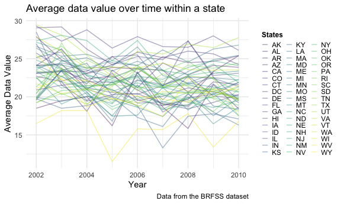

p8105\_hw3\_tk2886
================
Tanvir Khan
2021-10-21

# QUESTION 1

### Loading the instacart data and cleaning the instacart data

``` r
data("instacart")

instacart_df <- 
  instacart %>% 
  janitor::clean_names()
```

This information was gathered from the p8105 website. It is indicated
that Instacart is an online grocery service that allows people to shop
online from local stores. In New York City, some of the partner stores
include Whole Foods and The Food Emporium. “The Instacart Online Grocery
Shopping Dataset 2017” is an anonymized dataset with over three million
online grocery orders from more than 200,000 Instacart users. We will be
using this dataset to analyze specific things and outputting the results
in a table or visual plots.

### Analysis of instacart data

``` r
dimension_instacart = 
  instacart_df %>% 
  dim()

instacart_row = 
  instacart_df %>% 
  nrow()

instacart_col = 
  instacart_df %>% 
  ncol()

key_variables = 
  instacart_df %>% 
  names()
```

The dimension of the *instacart dataframe* is **1384617, 15**. The
dimensions represents the number of rows and the columns. The number of
*rows* in the instacart dataframe are **1384617**. The number of
*columns* in the instacart dataframe are **15**.

### Analyzing the Aisle column in the dataset

``` r
aisle_analysis <- 
  instacart_df %>%
  group_by(aisle) %>%
  summarise(quantity_ordered = n()) %>%
  arrange(desc(quantity_ordered))

number_of_aisles <-
  aisle_analysis %>% nrow()

top_aisle <-
  aisle_analysis %>%
  pull(aisle) %>%
  first()

top_five_aisle <- 
  aisle_analysis %>%
  pull(aisle) %>%
  head(5)
```

After analyzing the dataset, there are **134** aisles. The top aisle in
the dataset is **fresh vegetables**. The top five aisles with the most
items ordered from are **fresh vegetables, fresh fruits, packaged
vegetables fruits, yogurt, packaged cheese**.

### Plot that shows the aisles with more than 10000 items ordered from.

``` r
instacart_df %>%
  group_by(aisle) %>%
  summarise(aisle_n = n()) %>%
  filter(aisle_n > 10000) %>%
  ggplot(aes(x = reorder(aisle, aisle_n), y = aisle_n)) +
  geom_bar(stat = "identity") + 
  labs(
    title = "Number of items ordered in each Aisles",
    subtitle = "From Aisles with 10K orders", 
    x = "Aisle Name",
    y = "Number of items ordered",
    caption = "Data from the Instacart package"
  ) + 
  coord_flip() +
  theme(axis.text.y = element_text(size = 7, face = "bold"))
```


This plot shows the number of items ordered in each Aisle from the
Aisles that have more than 10,000 items ordered. The plot is arranged in
a descending order which shows at the top of the plot with the aisles
with the most items ordered. The top five aisles from the aisles with
more than 10,000 items are Fresh Vegetables, Fresh Fruits, Packaged
vegetable fruits, yogurts, and packaged cheese.

### Creating A table showing the three most popular items in each of the aisles “baking ingredients”, “dog food care”, and “packaged vegetables fruits”.

``` r
instacart_df %>%
  filter(aisle %in% c("baking ingredients", "dog food care", "packaged vegetables fruits")) %>%
  group_by(aisle, product_name) %>%
  summarise(Product_Quantity = n()) %>%
  filter(min_rank(desc(Product_Quantity)) < 4) %>%
  arrange(aisle, desc(Product_Quantity)) %>%
  knitr::kable(
    caption = 
      "**Table 1: Showcasing the Three Most Popular items in Baking Ingredients Aisle, Dog Food Care Aisle, and Packaged Vegetables Fruits aisle**"
  ) 
```

| aisle                      | product\_name                                 | Product\_Quantity |
|:---------------------------|:----------------------------------------------|------------------:|
| baking ingredients         | Light Brown Sugar                             |               499 |
| baking ingredients         | Pure Baking Soda                              |               387 |
| baking ingredients         | Cane Sugar                                    |               336 |
| dog food care              | Snack Sticks Chicken & Rice Recipe Dog Treats |                30 |
| dog food care              | Organix Chicken & Brown Rice Recipe           |                28 |
| dog food care              | Small Dog Biscuits                            |                26 |
| packaged vegetables fruits | Organic Baby Spinach                          |              9784 |
| packaged vegetables fruits | Organic Raspberries                           |              5546 |
| packaged vegetables fruits | Organic Blueberries                           |              4966 |

**Table 1: Showcasing the Three Most Popular items in Baking Ingredients
Aisle, Dog Food Care Aisle, and Packaged Vegetables Fruits aisle**

The most popular product in Baking Ingredients aisle is Light Brown
sugar with 499 times ordered. The most popular product in dog food care
is Snack sticks chicken & rice recipe dog treats with 30 times ordered.
The most popular product in packaged vegetable fruits is organic baby
spinach which has been ordered 9,784 times.

### Showing the mean hour of the day at which Pink Lady Apples and Coffee Ice Cream are ordered on each day of the week; format this table for human readers (i.e. produce a 2 x 7 table).

``` r
instacart_df %>%
  mutate(order_dow = recode(order_dow,
                            '0' = 'Sunday',
                            '1' = 'Monday',
                            '2' = "Tuesday",
                            '3' = "Wednesday",
                            '4' = "Thursday",
                            '5' = "Friday",
                            '6' = "Saturday")) %>%
  filter(product_name %in% c("Pink Lady Apples", "Coffee Ice Cream")) %>%
  group_by(product_name, order_dow) %>%
  summarise(mean_hour = mean(order_hour_of_day)) %>%
  pivot_wider(
    names_from = order_dow, 
    values_from = mean_hour
  ) %>%
  select(product_name, Sunday, Monday, Tuesday, Wednesday, Thursday, Friday, Saturday, everything()) %>%
  knitr::kable(
    digits = 1, 
    caption = 
      "**Table 2: Mean Hour of the day at which Pink Lady Apples and Coffee Icre Cream are ordered eady day of the week**" 
  )
```

| product\_name    | Sunday | Monday | Tuesday | Wednesday | Thursday | Friday | Saturday |
|:-----------------|-------:|-------:|--------:|----------:|---------:|-------:|---------:|
| Coffee Ice Cream |   13.8 |   14.3 |    15.4 |      15.3 |     15.2 |   12.3 |     13.8 |
| Pink Lady Apples |   13.4 |   11.4 |    11.7 |      14.2 |     11.6 |   12.8 |     11.9 |

**Table 2: Mean Hour of the day at which Pink Lady Apples and Coffee
Icre Cream are ordered eady day of the week**

Table 2 shows the mean hour of the day at which Pink Lady Apples and
Coffee Ice Cream are ordered on each day of the week. **Coffee Ice
Cream** is ordered latest on *Tuesday*, while **Pink Lady Apples** is
ordered latest on *Wednesday*. Between Coffee Ice Cream and Pink Lady
Apples, **Pink Lady Apples** are ordered earlier in the day out of the
for Sunday, Monday, Tuesday, Wednesday, Thursday, and Saturday. Friday
is the only day when **Coffee Ice Cream** is ordered earlier in the day.

# QUESTION 2

### Loading the brfss\_smart2010 data and cleaning the brfss\_smart2010 data

``` r
data("brfss_smart2010")

behavorial_df <- 
  brfss_smart2010 %>% 
  janitor::clean_names() %>%
  filter(topic == "Overall Health") %>%
  filter(response %in% c("Excellent", "Very good", "Good", "Fair", "Poor")) %>% 
  mutate(response = as.factor(response)) %>%
  mutate(response = forcats::fct_relevel(response, c("Poor", "Fair", "Good", "Very good", "Excellent")))
```

The brfss\_smart 2010 dataset contains data from the Behavioral Risk
Factors Surveillance System for Selected Metropolitan Area Risk Trends
(SMART) for 2002-2010. The data is allowed to be accessed from data.gov.
This data may be used to identify emerging health problems, establish
and trak health objectives, and develop and evaluate public health
policies and programs. The dataset is not final since the data will be
updated annually as it becomes available.

### Analyzing which states for 2002 observed at 7 or more locations

``` r
bhdf_2002 <- 
  behavorial_df %>%
  rename(States = locationabbr) %>%
  filter(year == 2002) %>%
  group_by(States) %>%
  summarise(location_count = n_distinct(locationdesc)) %>%
  filter(location_count >= 7) %>%
  arrange(location_count)

bhdf_2002 %>% knitr::kable()
```

| States | location\_count |
|:-------|----------------:|
| CT     |               7 |
| FL     |               7 |
| NC     |               7 |
| MA     |               8 |
| NJ     |               8 |
| PA     |              10 |

``` r
states_2002 <- 
  bhdf_2002 %>% pull(States)
```

In *2002*, **CT, FL, NC, MA, NJ, PA** are the six states that were
observed at 7 or more locations.

### Analyzing which states for 2010 observed at 7 or more locations

``` r
bhdf_2010 <- 
  behavorial_df %>%
  rename(States = locationabbr) %>%
  filter(year == 2010) %>%
  group_by(States) %>%
  summarise(location_count = n_distinct(locationdesc)) %>%
  filter(location_count >= 7) %>%
  arrange(location_count) 

bhdf_2010 %>% knitr::kable()
```

| States | location\_count |
|:-------|----------------:|
| CO     |               7 |
| PA     |               7 |
| SC     |               7 |
| OH     |               8 |
| MA     |               9 |
| NY     |               9 |
| NE     |              10 |
| WA     |              10 |
| CA     |              12 |
| MD     |              12 |
| NC     |              12 |
| TX     |              16 |
| NJ     |              19 |
| FL     |              41 |

``` r
states_2010 <- 
  bhdf_2010 %>% pull(States)
```

In *2010*, **CO, PA, SC, OH, MA, NY, NE, WA, CA, MD, NC, TX, NJ, FL**
are the 14 states that were observed at 7 or more locations.

### Creating a Spaghetti Plot of the average value over time within a state

``` r
behavorial_df %>%
  rename(States = locationabbr) %>%
  filter(response == "Excellent") %>%
  group_by(year, States) %>%
  summarise(mean_data_value = mean(data_value, na.rm = TRUE)) %>%
  ggplot(aes(x = year, y = mean_data_value, color = States)) +
  geom_line(aes(group = States), alpha = 0.4) +
  labs(
    title = "Average data value over time within a state",
    x = "Year",
    y = "Average Data Value",
    caption = "Data from the BRFSS dataset"
  ) + 
  theme(legend.position = "right",
        legend.title = element_text(size = 9, face = "bold"),
        legend.key.size = unit(0.3, 'cm'))
```



The spaghetti plot is showing the average data value of the places
within the states from 2002 to 2010. The data values vary for the states
from 2002 to 2010. It is hard to state if there’s a trend happening for
each specific state sine the data values vary as the we progress from
2002 to 2010.

### Making a two-panel plot showing, for the years 2006, and 2010, distribution of data\_value for responses (“Poor” to “Excellent”) among locations in NY State

``` r
behavorial_df %>%
  filter(year %in% c("2006", "2010"),
         locationabbr %in% c("NY")) %>%
  group_by(locationdesc) %>%
  ggplot(aes(x = response, y = data_value, color = response)) +
  geom_boxplot() +
  facet_grid(. ~ year) +
  theme(axis.text.x = element_text(size = 7, face = "bold")) 
```


This 2 sided-panel boxplot displays the distribution of data value for
responses (“Poor” to “Excellent”) among locations in New York State.

# Question 3

### Loading the Original Data and saving this and comparing this data to the new tidied data

``` r
accel_dfa <- 
  read_csv("./data/accel_data.csv") %>%
  janitor::clean_names() 
```

    ## Rows: 35 Columns: 1443

    ## ── Column specification ────────────────────────────────────────────────────────
    ## Delimiter: ","
    ## chr    (1): day
    ## dbl (1442): week, day_id, activity.1, activity.2, activity.3, activity.4, ac...

    ## 
    ## ℹ Use `spec()` to retrieve the full column specification for this data.
    ## ℹ Specify the column types or set `show_col_types = FALSE` to quiet this message.

### Clean and Tidying the data

``` r
new_accel_df <-
  accel_dfa %>%
  pivot_longer(
    activity_1:activity_1440,
    names_to = "minute",
    names_prefix = "activity_",
    values_to = "activity_count") %>%
  mutate(
    week = as.integer(week), 
    day_id = as.integer(day_id), 
    minute = as.integer(minute),
    hour = as.integer(minute %/% 60), 
    day = factor(day, levels = c("Sunday","Monday", "Tuesday", "Wednesday", "Thursday", "Friday", "Saturday")),
    weekday_vs_weekend = 
      case_when(
           day %in% c("Monday", "Tuesday", "Wednesday", "Thursday", "Friday") ~ "Weekday", 
           day %in% c("Saturday", "Sunday") ~ "Weekend")) 
```

Both the original accelerometer dataset that was provided and the
cleaned and tidy version that is created from that specific data frame
represents data for one person. This dataset shows the collected
measures of “activity counts” in a short period; one-minute intervals.
There is not 50,400 different people or objects or entity but rather the
50,400 represents the 50,400 minutes that was logged in by that one
person. That male individual was observed and measured for 35 days by
using an accelerometer. The information that was provided with the
dataset states that the activity counts for each minute of a 24 hour day
starting at midnight which means we have data for the whole day instead
of specific time of the day. We may also divide 50,400 by 1440 (1440
minutes equals to one day) which equals to 35 days which is the number
of days that the male individual was observed for.

### Analyzing the accelerometer data

``` r
original_accel_df = 
  accel_dfa %>% dim()
original_accel_row = 
  accel_dfa %>% nrow()
original_accel_col = 
  accel_dfa %>% ncol()

key_var = 
  new_accel_df %>% names()
accel_dim = 
  new_accel_df %>% dim()
accel_row = 
  new_accel_df %>% nrow()
accel_col = 
  new_accel_df %>% ncol()
```

The original dataset that was provided to us has the *dimension* of
**35, 1443**. We may be more specific and state that the number of
*rows* in the original dataset is **35**. The number of *cols* in the
original data is **1443**.

The tidied data set that I created has *dimensions* of **50400, 7**. The
*key variables* in this tidied dataset are **week, day\_id, day, minute,
activity\_count, hour, weekday\_vs\_weekend**. The number of *rows* in
this tidied dataset are **50400**. The number of *columns* in this
tidied dataset are **7**.

### A table that shows the total activity count for each day of the week

``` r
new_accel_df %>%
  rename(Day = day) %>% 
  group_by(Day) %>%
  summarize(Total_Activity_Count = sum(activity_count, na.rm = TRUE)) %>%
  knitr::kable(caption = 
      "**Table 1: Total Activity Count for each day (Sunday-Saturday)**"
  )
```

| Day       | Total\_Activity\_Count |
|:----------|-----------------------:|
| Sunday    |                1919213 |
| Monday    |                1858699 |
| Tuesday   |                1799238 |
| Wednesday |                2129772 |
| Thursday  |                2091151 |
| Friday    |                2291711 |
| Saturday  |                1369237 |

**Table 1: Total Activity Count for each day (Sunday-Saturday)**

**Analysis of Table 1:** One trend that is shown is that towards end of
the each week, Wednesday, Thursday, and Friday, the activity count is
higher compared to other days.

# Problem 3

``` r
new_accel_df %>%
  group_by(day, minute) %>%
  ggplot(aes(x = minute, 
             y = activity_count, 
             color = day)) +
  geom_point() +
  labs(
    title = "Analysis of 24-hour Activity Per Day",
    x = "Hour in a Day (0 Hour - 24 hour)",
    y = "Total Activity Counts for Each Hour",
    caption = "Data From: Advanced Cardiac Care Center of Columbia University Medical Center") + 
  scale_x_continuous(
    breaks = c(0, 240, 480, 720, 960, 1200, 1440),
    labels = c("0hr", "4hr", "8hr", "12hr", "16hr", "20hr", "24hr")) +
  theme(legend.position = "right")
```


**Analysis of** *“Analysis of 24-hour Activity Per Day Plot”:* One trend
that is indicated from the graph is that the activity count is higher
later on night on Thursday, Friday, Saturday. Earlier in the week like
Sunday and Monday, the activity count is higher in the late morning
hours to afternoon (12pm) hour.
