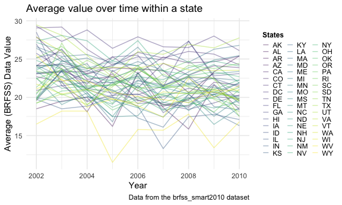

p8105\_hw3\_tk2886
================

``` r
library(tidyverse)
```

    ## ── Attaching packages ─────────────────────────────────────── tidyverse 1.3.1 ──

    ## ✓ ggplot2 3.3.5     ✓ purrr   0.3.4
    ## ✓ tibble  3.1.4     ✓ dplyr   1.0.7
    ## ✓ tidyr   1.1.3     ✓ stringr 1.4.0
    ## ✓ readr   2.0.1     ✓ forcats 0.5.1

    ## ── Conflicts ────────────────────────────────────────── tidyverse_conflicts() ──
    ## x dplyr::filter() masks stats::filter()
    ## x dplyr::lag()    masks stats::lag()

``` r
library(patchwork)
library(p8105.datasets)
library(ggridges)

## Set Global Options 
knitr::opts_chunk$set(
  fig.width = 6,
  fig.asp = .6, 
  out.width = "90%"
)

theme_set(theme_minimal() + theme(legend.position = "bottom"))

options(
  ggplot2.continuous.colour = "viridis",
  ggplot2.continuous.fill = "viridis"
)

scale_colour_discrete = scale_colour_viridis_d
scale_fill_discrete = scale_fill_viridis_d
```

# QUESTION 1

Loading Data and Cleaning Data with janitor

``` r
data("instacart")

instacart_df <- 
  instacart %>% 
  janitor::clean_names()
```

Analysis of instacart data

``` r
dimension_instacart = dim(instacart_df)
instacart_row = nrow(instacart_df)
instacart_col = ncol(instacart_df)
key_variables = names(instacart_df)
```

The dimension of the instacart dataframe is 1384617, 15. The dimensions
represents the number of rows and the columns. The number of rows in the
instacart dataframe are 1384617. The number of columns in the instacart
dataframe are 15.

Analyzing the Aisle Column/Variable and arranging most aisles with the
most items

``` r
instacart_df %>%
  group_by(aisle) %>%
  summarise(n_obs = n()) %>%
  arrange(desc(n_obs))
```

    ## # A tibble: 134 × 2
    ##    aisle                          n_obs
    ##    <chr>                          <int>
    ##  1 fresh vegetables              150609
    ##  2 fresh fruits                  150473
    ##  3 packaged vegetables fruits     78493
    ##  4 yogurt                         55240
    ##  5 packaged cheese                41699
    ##  6 water seltzer sparkling water  36617
    ##  7 milk                           32644
    ##  8 chips pretzels                 31269
    ##  9 soy lactosefree                26240
    ## 10 bread                          23635
    ## # … with 124 more rows

After analyzing the data frame, there are **134 aisles**.

Filtering the aisles with more than 10000 items ordered.

``` r
instacart_df %>%
  group_by(aisle) %>%
  summarise(aisle_n = n()) %>%
  filter(aisle_n > 10000) %>%
  ggplot(aes(x = reorder(aisle, aisle_n), y = aisle_n)) +
  geom_bar(stat = "identity") + 
  labs(
    title = "Number of items ordered in each Aisle",
    x = "Aisle Identification",
    y = "Quantitiy purchased from each Aisle",
    caption = "Data from the Instacart package"
  ) + 
  coord_flip()
```



Creating A table showing the three most popular items in each of the
aisles “baking ingredients”, “dog food care”, and “packaged vegetables
fruits”.

``` r
instacart_df %>%
  filter(aisle %in%  c("baking ingredients", "dog food care", "packaged vegetables fruits")) %>%
  group_by(aisle, product_name) %>%
  summarise(Product_Quantity = n()) %>%
  filter(min_rank(desc(Product_Quantity)) < 4) %>%
  arrange(aisle, desc(Product_Quantity)) %>%
  knitr::kable()
```

    ## `summarise()` has grouped output by 'aisle'. You can override using the `.groups` argument.

| aisle                      | product\_name                                 | Product\_Quantity |
|:---------------------------|:----------------------------------------------|------------------:|
| baking ingredients         | Light Brown Sugar                             |               499 |
| baking ingredients         | Pure Baking Soda                              |               387 |
| baking ingredients         | Cane Sugar                                    |               336 |
| dog food care              | Snack Sticks Chicken & Rice Recipe Dog Treats |                30 |
| dog food care              | Organix Chicken & Brown Rice Recipe           |                28 |
| dog food care              | Small Dog Biscuits                            |                26 |
| packaged vegetables fruits | Organic Baby Spinach                          |              9784 |
| packaged vegetables fruits | Organic Raspberries                           |              5546 |
| packaged vegetables fruits | Organic Blueberries                           |              4966 |

Showing the mean hour of the day at which Pink Lady Apples and Coffee
Ice Cream are ordered on each day of the week; format this table for
human readers (i.e. produce a 2 x 7 table).

``` r
instacart_df %>%
  filter(product_name %in% c("Pink Lady Apples", "Coffee Ice Cream")) %>%
  group_by(product_name, order_dow) %>%
  summarise(mean_hour = mean(order_hour_of_day)) %>%
  pivot_wider(
    names_from = order_dow, 
    values_from = mean_hour
  )
```

    ## `summarise()` has grouped output by 'product_name'. You can override using the `.groups` argument.

    ## # A tibble: 2 × 8
    ## # Groups:   product_name [2]
    ##   product_name       `0`   `1`   `2`   `3`   `4`   `5`   `6`
    ##   <chr>            <dbl> <dbl> <dbl> <dbl> <dbl> <dbl> <dbl>
    ## 1 Coffee Ice Cream  13.8  14.3  15.4  15.3  15.2  12.3  13.8
    ## 2 Pink Lady Apples  13.4  11.4  11.7  14.2  11.6  12.8  11.9

# QUESTION 2

Loading the Data and Cleaning the Data with janitor

``` r
data("brfss_smart2010")

behavorial_df <- 
  brfss_smart2010 %>% 
  janitor::clean_names() %>%
  filter(topic == "Overall Health") %>%
  mutate(response = forcats::fct_relevel(response, c("Poor", "Fair", "Good", "Very good", "Excellent")))
```

Analyzing 2002 for which states observed at 7 or more locations

``` r
behavorial_df %>%
  filter(year == 2002) %>%
  group_by(locationabbr) %>%
  summarise(location_count = n_distinct(locationdesc)) %>%
  filter(location_count >= 7) %>%
  arrange(desc(location_count))
```

    ## # A tibble: 6 × 2
    ##   locationabbr location_count
    ##   <chr>                 <int>
    ## 1 PA                       10
    ## 2 MA                        8
    ## 3 NJ                        8
    ## 4 CT                        7
    ## 5 FL                        7
    ## 6 NC                        7

Analyzing 2010 for which states observed at 7 or more locations

``` r
behavorial_df %>%
  filter(year == 2010) %>%
  group_by(locationabbr) %>%
  summarise(location_count = n_distinct(locationdesc)) %>%
  filter(location_count >= 7) %>%
  arrange(desc(location_count))
```

    ## # A tibble: 14 × 2
    ##    locationabbr location_count
    ##    <chr>                 <int>
    ##  1 FL                       41
    ##  2 NJ                       19
    ##  3 TX                       16
    ##  4 CA                       12
    ##  5 MD                       12
    ##  6 NC                       12
    ##  7 NE                       10
    ##  8 WA                       10
    ##  9 MA                        9
    ## 10 NY                        9
    ## 11 OH                        8
    ## 12 CO                        7
    ## 13 PA                        7
    ## 14 SC                        7

Creating a Spaghetti Plot of the average value over time within a state

``` r
behavorial_df %>%
  filter(response == "Excellent") %>%
  group_by(year, locationabbr) %>%
  summarise(mean_data_value = mean(data_value, na.rm = TRUE)) %>%
  ggplot(aes(x = year, y = mean_data_value, color = locationabbr)) +
  geom_line(aes(group = locationabbr)) +
  labs(
    title = "Average Value throughout the year ",
    x = "Year",
    y = "Average Value",
    caption = "Data from the BRFSS"
  ) + 
  viridis::scale_color_viridis(name = "Location",
                               discrete = TRUE) +
  theme(legend.position = "right")
```

    ## `summarise()` has grouped output by 'year'. You can override using the `.groups` argument.


Making a two-panel plot showing, for the years 2006, and 2010,
distribution of data\_value for responses (“Poor” to “Excellent”) among
locations in NY State

``` r
behavorial_df %>%
  filter(year %in% c("2006", "2010"),
         locationabbr %in% c("NY")) %>%
  ggplot(aes(x = data_value, y = response)) + 
  geom_density_ridges(scale = .85) +
  facet_grid(~ year)
```

    ## Picking joint bandwidth of 2.1

    ## Picking joint bandwidth of 2.03


\#Question 3

``` r
accel_dfa <- 
  read_csv("./data/accel_data.csv") %>%
  janitor::clean_names() 
```

    ## Rows: 35 Columns: 1443

    ## ── Column specification ────────────────────────────────────────────────────────
    ## Delimiter: ","
    ## chr    (1): day
    ## dbl (1442): week, day_id, activity.1, activity.2, activity.3, activity.4, ac...

    ## 
    ## ℹ Use `spec()` to retrieve the full column specification for this data.
    ## ℹ Specify the column types or set `show_col_types = FALSE` to quiet this message.

``` r
new_accel_df <-
  accel_dfa %>%
  pivot_longer(
    activity_1:activity_1440,
    names_to = "minute",
    names_prefix = "activity_",
    values_to = "activity_counts") %>%
  mutate(
    week = as.integer(week), 
    day_id = as.integer(day_id), 
    minute = as.integer(minute),
    hour = as.integer(minute %/% 60), 
    day = factor(day, levels = c("Sunday","Monday", "Tuesday", "Wednesday", "Thursday", "Friday", "Saturday")),
    weekday_vs_weekend = 
      case_when(
           day %in% c("Monday", "Tuesday", "Wednesday", "Thursday", "Friday") ~ "Weekday", 
           day %in% c("Saturday", "Sunday") ~ "Weekend")) 
```

``` r
original_accel_df = accel_dfa %>% dim()
original_accel_row = accel_dfa %>% nrow()
original_accel_col = accel_dfa %>% ncol()

key_var = new_accel_df %>% names()
accel_dim = new_accel_df %>% dim()
accel_row = new_accel_df %>% nrow()
accel_col = new_accel_df %>% ncol()
```

Both the original accelerometer data frame that was provided and the
cleaned and tidy version that is created fro that specific data frame
represents data for one person and this data measures “activity counts”
in a short period; one-minute intervals. There is not 50,400.

Part 2

``` r
new_accel_df %>%
  group_by(day_id, day) %>%
  summarize(total_activity = sum(activity_counts, na.rm = TRUE)) %>%
  knitr::kable()
```

    ## `summarise()` has grouped output by 'day_id'. You can override using the `.groups` argument.

| day\_id | day       | total\_activity |
|--------:|:----------|----------------:|
|       1 | Friday    |       480542.62 |
|       2 | Monday    |        78828.07 |
|       3 | Saturday  |       376254.00 |
|       4 | Sunday    |       631105.00 |
|       5 | Thursday  |       355923.64 |
|       6 | Tuesday   |       307094.24 |
|       7 | Wednesday |       340115.01 |
|       8 | Friday    |       568839.00 |
|       9 | Monday    |       295431.00 |
|      10 | Saturday  |       607175.00 |
|      11 | Sunday    |       422018.00 |
|      12 | Thursday  |       474048.00 |
|      13 | Tuesday   |       423245.00 |
|      14 | Wednesday |       440962.00 |
|      15 | Friday    |       467420.00 |
|      16 | Monday    |       685910.00 |
|      17 | Saturday  |       382928.00 |
|      18 | Sunday    |       467052.00 |
|      19 | Thursday  |       371230.00 |
|      20 | Tuesday   |       381507.00 |
|      21 | Wednesday |       468869.00 |
|      22 | Friday    |       154049.00 |
|      23 | Monday    |       409450.00 |
|      24 | Saturday  |         1440.00 |
|      25 | Sunday    |       260617.00 |
|      26 | Thursday  |       340291.00 |
|      27 | Tuesday   |       319568.00 |
|      28 | Wednesday |       434460.00 |
|      29 | Friday    |       620860.00 |
|      30 | Monday    |       389080.00 |
|      31 | Saturday  |         1440.00 |
|      32 | Sunday    |       138421.00 |
|      33 | Thursday  |       549658.00 |
|      34 | Tuesday   |       367824.00 |
|      35 | Wednesday |       445366.00 |

Part 3

``` r
new_accel_df %>%
  group_by(day, minute) %>%
  ggplot(aes(x = minute, y = activity_counts, color = day)) +
  geom_point() +
  labs(
    title = "Analysis of 24-hour Activity Per Day",
    x = "Hour in a Day (0 Hour - 24 hour)",
    y = "Total Activity Counts for Each Hour",
    caption = "Data From: Advanced Cardiac Care Center of Columbia University Medical Center")
```


``` r
  scale_x_continuous(
    breaks = c(0, 240, 480, 720, 960, 1200, 1440),
    labels = c("0hr", "4hr", "8hr", "12hr", "16hr", "20hr", "24hr"))
```

    ## <ScaleContinuousPosition>
    ##  Range:  
    ##  Limits:    0 --    1
